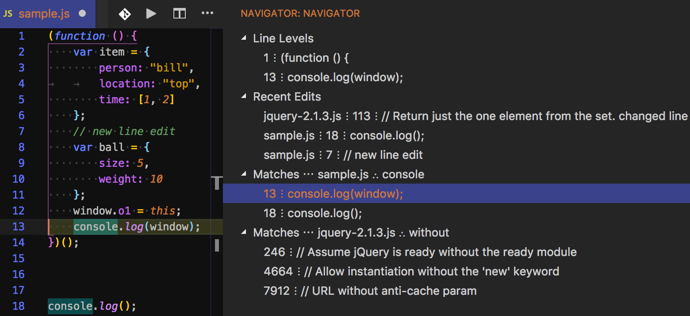

# Navigator

An extension focusing on improving general editor experience especially in the areas of navigating code.

## Provided Features
- Navigator View
  - use command `Add Matches` to add a new match group to the view
    - the match group will contain all `find matches` or all matching instances of the current selection
  - `Recent Edits` section will show all recent edit locations
  - clicking matches in tree view will reveal that line in the document 
- `Cursor word right until end`  command to skip words, but stop at end of line
- `Cursor word left until begin` command to skip words, but stop at beginning of line
- `Cursor jump fixed space up`   command to skip 5 vertical spaces at a time
- `Cursor jump fixed space down` command to skip 5 vertical spaces at a time

